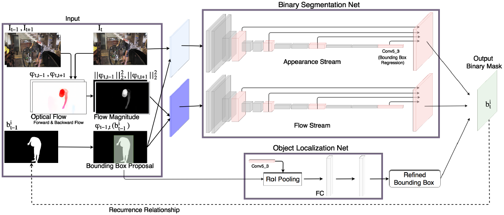
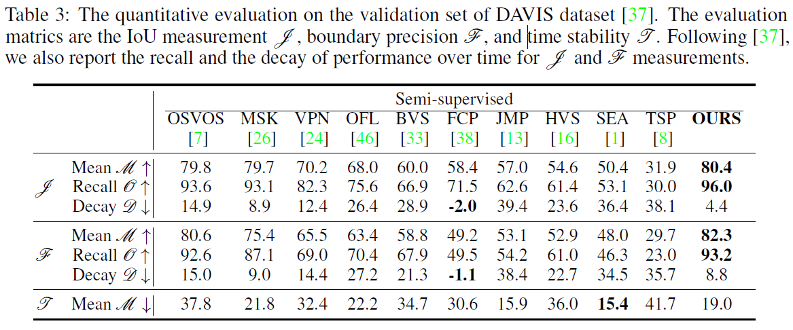
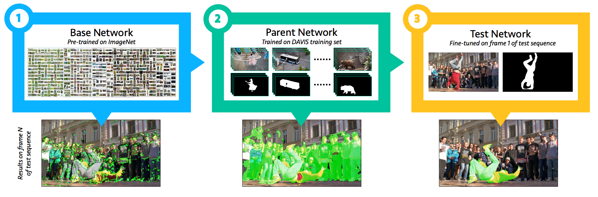
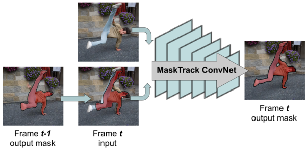
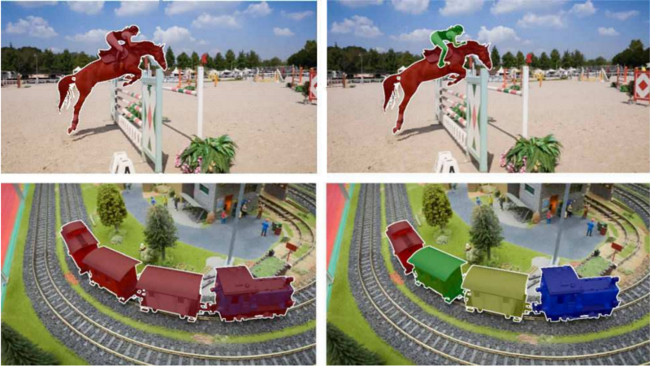

# Semi-Supervised Video Object Segmentation (VOS) with Tensorflow

The aim of this project is to implement and compare implementations of several **video object segmentation (VOS)** algorithms using **Tensorflow**. As part of the [NIPS Paper Implementation Challenge](https://nurture.ai/p/5d493c07-fd39-455b-a6a5-ab4a46f00981), we chose *MaskRNN: Instance Level Video Object Segmentation* (NIPS 2017) [[2017h]](#2017h) as our first implementation.

# MaskRNN

## Development Status

- [x] MaskRNN (step 1 of 4): Implement Binary Segmentation net Appearance Stream (`AStream`)
- [x] MaskRNN (step 2 of 4): Implement Binary Segmentation net Flow Stream (`FStream`)
- [ ] MaskRNN (step 3 of 4): Implement Object Localization net Apply
- [ ] MaskRNN (step 3 of 4): Implement RNN

See the `MaskRNN Tensorflow Implementation` Section for more info.

## About MaskRNN

MaskRNN uses a RNN which fuses in each frame the output of two deep nets for each object instance — a **binary segmentation net** providing a mask and a **localization net** providing a bounding box. Presumably, the recurrent component and the localization component take advantage of long-term temporal structures in video data and help in rejecting outliers.

Here's an illustration of the MaskRNN architecture:

## MaskRNN Tensorflow Implementation

### Setup

The code in this repo was developed and tested using Anaconda3 v.4.4.0. To reproduce our conda environment, please use the following files:

*On Ubuntu:*
- [dlubu36tfvos.yml](tfvos/setup/dlubu36tfvos.yml)
- [requirements_ubu.txt](tfvos/setup/requirements_ubu.txt)

*On Windows:*
- [dlwin36tfvos.yml](tfvos/setup/dlwin36tfvos.yml)
- [requirements_win.txt](tfvos/setup/requirements_win.txt)

Please note that for optical flow computations, we did not use flowNet2.0, as in the original paper. Instead, we used `pyflow`, a Python wrapper for Ce Liu's C++ implementation of Coarse2Fine Optical Flow. Make sure to install **our fork** using the instructions available [here](https://github.com/philferriere/pyflow) otherwise you will not be able to warp predicted masks using optical flow. 

### Jupyter Notebooks

The recommended way to test this implementation is to use the following jupyter notebooks:
- [vgg16_surgery.ipynb](tfvos/vgg16_surgery.ipynb): Each MaskRNN segmentation convnet is initialized from a VGG16 network pre-trained on ImageNet. This pre-trained network takes RGB images as an input (W x H x 3). The `FStream` network also takes 3-channel inputs so we can use the VGG16 network pre-trained on ImageNet as a starting point. However, the `AStream` network takes 4-channel inputs. Use this notebook to **perform net surgery and create a 4-channel input version** initialized with the same parameter values except for the additional convolutional filter dimension (we use Gaussian initialization).
- [davis2016_dataset_no_aug.ipynb](tfvos/davis2016_dataset_no_aug.ipynb) or [davis2016_dataset_with_aug.ipynb](tfvos/davis2016_dataset_with_aug.ipynb): Use one these two notebooks to preprocess the dataset and generate all the additional input channels used by MaskRNN (optical flow magnitudes of previous and next frame, previous mask warped with the previous-to-current frame optical flow). The first notebook doesn't use **augmentation**, the second one does. If you have lots of RAM (>32Gb), use the augmented version.
- [astream_offline_training.ipynb](tfvos/astream_offline_training.ipynb): Use this notebook for **offline training of the appearance stream** branch of the binary segmentation network.
- [fstream_offline_training.ipynb](tfvos/fstream_offline_training.ipynb): Use this notebook for **offline training of the flow stream** branch of the binary segmentation network.
- [astream_online_training.ipynb](tfvos/astream_online_training.ipynb): Use this notebook for **finetuning of the appearance stream** branch of the binary segmentation network. You can only use this notebook after having run the offline training notebook for the same branch.
- [fstream_online_training.ipynb](tfvos/fstream_online_training.ipynb): Use this notebook for **finetuning of the flow stream** branch of the binary segmentation network. You can only use this notebook after having run the offline training notebook for the same branch.

### Credits
This implementation is based in large part on Sergi Caelles Prats' Tensorflow implementation of [[2016a]](#2016a). His original work can be found [here](https://github.com/scaelles/OSVOS-TensorFlow):

	@Inproceedings{Cae+17,
	  Title          = {One-Shot Video Object Segmentation},
	  Author         = {S. Caelles and K.K. Maninis and J. Pont-Tuset and L. Leal-Taix\'e and D. Cremers and L. {Van Gool}},
	  Booktitle      = {Computer Vision and Pattern Recognition (CVPR)},
	  Year           = {2017}
	}
We also used code from [Matterport's Mask R-CNN project](https://github.com/matterport/Mask_RCNN), copyright (c) 2017 Matterport, Inc., written by Waleed Abdulla, licensed under the MIT License.

# Background Info on VOS

Here are two recommended, short introductory posts ([[2017a]](#2017a) and [[2017b]](#2017b)) by [@eddiesmo](https://github.com/eddiesmo).

Per [[2018a]](#2018a), mostly (ignoring mono vs multi-instance distinction), there are two kinds of video object segmentation scenarios:

- **Semi-supervised video object segmentation**. Segments one (mono-instance) or more (multi-instance) objects along an entire video when we are only given *one single labeled training image* (typically, the first frame of the video).

- **Unsupervised video object segmentation**. Discovers the most salient, or primary, objects that move against a video’s background
or display different color statistics. Aka *video saliency detection*, or *video primary object segmentation*

Generally, both approaches rely on convnets that are pre-trained on object segmentation datasets.

## VOS Performance Metrics

Per [[2017h]](#2017h), VOS algorithms are evaluated using the following metrics:

**Intersection over union** *J*: We use the common mean intersection over union (IoU) metric which calculates the average across all frames of the dataset. The IoU metric is particularly challenging for small sized foreground objects.

**Contour accuracy** *F*: Besides an accurate object overlap measured by IoU, we are also interested in an accurate delineation of the foreground objects. To assess the delineation quality of our approach, we measure the precision, P, and the recall R of the two sets of points on the contours of the ground truth segment and the output segment via a bipartite graph matching. The contour accuracy is calculated as 2PR/(P+R).

**Temporal stability**  *T*: The temporal stability estimates the degree of deformation needed to transform the segmentation masks from one frame to the next. The temporal stability is measured by the dissimilarity of the shape context descriptors which describe the points on the contours of the segmentation between the two adjacent frames.

In the last column below are the results of MaskRCNN for *J*, *F* and *T* computed on the DAVIS dataset:

## VOS Reference Architectures

Per [[2017a]](#2017a), with the release of the DAVIS-2016 dataset for single object video segmentation, two main leading approaches emerged: MaskTrack and OSVOS [[2016a]](#2016a). Many DAVIS-2017 challenge teams built their solution on top of one of these two approaches.

### OSVOS-based Architectures

First, note that OSVOS method *segment frames independently without using temporal information*. OSVOS-based architectures follow a three-step process:

1. Find a convnet pre-trained for image classification or object detection (most commonly of the VGG or ResNet variety).

2. Perform a bit of surgery on it and train it as follows:

  - a. convert it to a fully convolutional network, à la FCN, thus preserving spatial information,
  - b. remove the final FC layers,
  - c. insert a new loss function, such as pixel-wise sigmoid balanced cross entropy (previously used by HED [[2015a]](#2015a))
  - d. train the new FCN on a video training set where all frames contain manually segmented objects, with 2 classes only (foreground object and background) as in DAVIS-2016 or with multiple individual objects (more than 2 classes) as in DAVIs-2017.

3. For each input video, *at test time*, fine-tune a different model using the video's first frame.

Per [[2017a]](#2017a), because for most videos the appearance of the object and the background does not change drastically, this model generally produces good results. However, running inference on a *different* video sequence won't perform as well.

### MaskTrack-based Architectures

While OSVOS works on each video frame independently, MaskTrack also *takes temporal information into consideration*. MaskTrack-based architectures follow a four-step process:

1. For each frame, feed the predicted mask of the previous frame as additional input to the network: the input is now 4 channels (RGB+previous mask). Initialize this process with the ground truth annotation given for the first frame.

2. The net, originally based on DeepLab VGG-16 (but modular), is trained from scratch on a combination of semantic segmentation and image saliency datasets. The input for the previous mask channel is artificially synthesized by small transformations of the ground truth annotation of each still image.

3. Add an identical second stream network, based on optical flow input. The model weights are the same as in the RGB stream. Fuse the outputs of both streams by averaging the results.

4. For each input video, use the first frame ground truth annotation to synthesize additional, video specific training data.

### Semi-supervised Video Object Segmentation

Semi-supervised video object segmentation utilizes human annotations on the first frame of a video (or more) indicating which object the system should track. The problem can be formulated as either a **binary segmentation task conditioned on the annotated frame** or a **mask propagation task between frames**.

#### Binary segmentation Convnets

Binary segmentation convnets typically *utilize the first frame for fine-tuning the network* to a specific sequence. The exact method for fine-tuning varies and longer fine-tuning typically results in better segmentation.

OSVOS [[2016a]](#2016a) uses additional contour cues and semantic segmentation information before simply fine-tuning on the first frame.

OnAVOS [[2017c]](#2017c) fine-tunes on the first frame and a subset of predictions from future frames.

#### Mask propagation Convnets

Mask propagation convnets *take in the previous mask prediction and a new frame* to propose a segmentation in the new frame. 

VPN [[2016b]](#2016b) trains a convnet with bilateral filtering to propagate to new frames.

MaskTrack [[2016c]](#2016c) trains a propagation network with synthetic transformations of still images and applies the same technique for online fine-tuning.

SegFlow [[2017d]](#2017d) finds that jointly learning moving object masks and optical flow helps to boost the segmentation performance.

LVO [[2017e]](#2017e) trains a two-stream network, using mask propagation and optical flow motion features that feed into a ConvGRU (Convolutional LSTM Network) layer to generate the final prediction.

In Lucid [[2017i]](#2017i), prediction of the current frame incorporates additional cues from the preceding frame using optical
flow.

As explained in [[2017h]](#2017h), all the methods listed above only address the foreground-background segmentation of a single object and are not directly applicable to instance level segmentation of multiple objects in videos. These methods do not explicitly model the location prior (e.g., a bounding box), which is important for object tracking.

MaskRNN [[2017h]](#2017h) allows *instance level segmentation of multiple objects* in videos by using a bottom-up approach
where they first track and segment individual objects before merging the results. To capture the temporal structure, they use a RNN while the segmentation of individual objects is based on predictions of binary segmentation masks confined to a predicted bounding box.

### Unsupervised VOS

Per [[2018a]](#2018a), recent work uses convnets to identify foreground pixels based on *saliency, edges, and/or motion (i.e., optical flow)*.

LMP [[2016d]](#2016d) trains a network which takes optical flow as an input to separate moving and non-moving regions and then combines the results with objectness cues from SharpMask [[2016e]](#2016e) to generate the moving object segmentation.

LVO [[2017e]](#2017e) can also be used in an unsupervised setting and trains a two-stream network, as explained in the previous section. 

FusionSeg [[2017f]](#2017f) also proposes a two-stream network that incorporates the magnitude of the optical flow between adjacent frames.

Sfm-net [[2017g]](#2017g) uses differentiable rendering to learn object masks and motion models without mask annotations.

> Note: The focus of this repo is NOT on unsupervised techniques.

# VOS Datasets

Datasets commonly used  in video object segmentation are:

- DAVIS 2016 and DAVIS 2017 datasets [[web]](http://davischallenge.org/code.html)
- Freiburg-Berkeley Motion Segmentation (FBMS) dataset [[web]](https://lmb.informatik.uni-freiburg.de/resources/datasets/moseg.en.html)
- SegTrack-v2 dataset [[web]](http://web.engr.oregonstate.edu/~lif/SegTrack2/dataset.html)

Per [[2017a]](#2017a), *multi-instance segmentation* is the main difference between annotations of DAVIS-2016 (left) and DAVIS-2017 (right):

# VOS References

## 2018
- [2018a] Li et al. 2018. Instance Embedding Transfer to Unsupervised Video Object Segmentation. [[arXiv]](https://arxiv.org/abs/1801.00908) 

## 2017

- [2017a] Smolyansky 2017. The Basics of Video Object Segmentation. [[medium]](https://techburst.io/video-object-segmentation-the-basics-758e77321914)
- [2017b] Smolyansky 2017. A Meta-analysis of DAVIS-2017 Video Object Segmentation Challenge. [[medium]](https://techburst.io/video-object-segmentation-the-basics-758e77321914)
- [2017c] Voigtlaender et al. 2017. OnAVOS: Online adaptation of convolutional neural networks for video object segmentation [[arXiv]](https://arxiv.org/abs/1706.09364) [[web]](https://www.vision.rwth-aachen.de/software/OnAVOS) [[Tensorflow]](https://www.vision.rwth-aachen.de/media/resource_files/OnAVOS.zip)
- [2017d] Cheng et al. 2017. Segflow: Joint learning for video object segmentation and optical flow.
[[arXiv]](https://arxiv.org/abs/1709.06750)
- [2017e] Tokmakov et al. 2017. LVO: Learning video object segmentation with visual memory. [[arXiv]](https://arxiv.org/abs/1704.05737) [[web]](http://thoth.inrialpes.fr/research/lvo/)
- [2017f] Jain et al. 2017. Fusionseg: Learning to combine motion and appearance for fully automatic segmention of generic objects in videos. [[arXiv]](https://arxiv.org/abs/1701.05384) [[caffee/matlab]](https://github.com/suyogduttjain/fusionseg)
- [2017g] Vijayanarasimhan et al. 2017. Sfm-net: Learning of structure and motion from video. [[arXiv]](https://arxiv.org/abs/1704.07804)
- [2017h] Hu et al. 2017. MaskRNN: Instance Level Video Object Segmentation. [[NIPS]](https://papers.nips.cc/paper/6636-maskrnn-instance-level-video-object-segmentation)
- [2017i] Khoreva et al. 2017. Lucid: Lucid data dreaming for object tracking. [[arXiv]](https://arxiv.org/abs/1703.09554) [[web]](https://www.mpi-inf.mpg.de/departments/computer-vision-and-multimodal-computing/research/weakly-supervised-learning/lucid-data-dreaming-for-object-tracking/) [[matlab]](https://github.com/ankhoreva/LucidDataDreaming)
- [2017j] Caelles et al. 2017. Semantically-guided video object segmentation. [[arXiv]](https://arxiv.org/abs/1704.01926)
- [2017k] Sharir at al. 2017. VOSTOP: Video Object Segmentation using Tracked Object Proposals. [[arXiv]](https://arxiv.org/abs/1707.06545)

## 2016

- [2016a] Caelles et al. 2016. OSVOS: One-shot video object segmentation. [[arXiv]](https://arxiv.org/abs/1611.05198) [[web]](http://people.ee.ethz.ch/~cvlsegmentation/osvos/) [[Tensorflow]](https://github.com/scaelles/OSVOS-TensorFlow) [[PyTorch]](https://github.com/kmaninis/OSVOS-PyTorch) [[Caffe]](https://github.com/kmaninis/OSVOS-caffe)
- [2016b] Jampani et al. 2016. Video Propagation Networks. [[arXiv]](https://arxiv.org/abs/1612.05478)
- [2016c] Khoreva et al. 2016. MaskTrack: Learning video object segmentation from static images. [[arXiv]](https://arxiv.org/abs/1612.02646) [[web]](https://www.mpi-inf.mpg.de/departments/computer-vision-and-multimodal-computing/research/weakly-supervised-learning/learning-video-object-segmentation-from-static-images/)
- [2016d] Tokmakov et al. 2016. Learning motion patterns in videos. [[arXiv]](https://arxiv.org/abs/1612.07217)
- [2016e] Pinheiro et al. 2016. SharpMask: Learning to refine object segments. [[arXiv]](https://arxiv.org/abs/1603.08695)
- [2016f] Ilg et al. 2016. Flownet 2.0: Evolution of optical flow estimation with deep networks. [[arXiv]](https://arxiv.org/abs/1612.01925) [[medium]](https://towardsdatascience.com/a-brief-review-of-flownet-dca6bd574de0) [[caffee/matlab]](https://github.com/lmb-freiburg/flownet2) [[pytorch]](https://github.com/NVIDIA/flownet2-pytorch)

## 2015

- [2015a] Xie et al. 2015. HED: Holistically-Nested Edge Detection. [[arXiv]](https://arxiv.org/abs/1504.06375) [[web]](http://vcl.ucsd.edu/hed/) [[caffe]](https://github.com/s9xie/hed)
